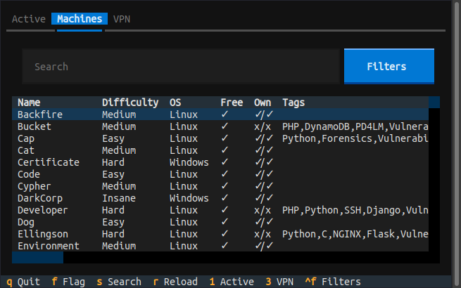

# 🛠️ HTBPanel

**HTBPanel** is a terminal user interface (TUI) built with [Textual](https://github.com/textualize/textual), designed for interacting with [Hack The Box](https://www.hackthebox.com/) machines directly from your terminal.

Whether you're hacking on a challenge or just exploring the platform, HTBPanel makes your workflow faster and more efficient — no more switching between browser tabs and terminal windows.

---

## 🚀 Features

HTBPanel supports a set of core functionalities that cover most day-to-day HTB tasks:

- ⚙️ Start, stop, and reset machines
- 🧠 View machine info (including IP address and status)
- 🔍 Search for machines by name or filter criteria
- 🏁 Submit flags

### 🔜 Coming Soon
Planned enhancements include:

- 📡 VPN connection status and info
- 🔄 Switch VPNs and download config file
- 🔄 Force machine/tag update within the app

---

## 📦 Installation

Set up the project with a few simple steps:

```bash
# Create a virtual environment (using uv for speed, but pip works too)
$ uv venv venv
$ source venv/bin/activate

# Install dependencies
$ uv pip install -r requirements.txt
```

---

## 🧑‍💻 Usage

Launch the TUI with:

```bash
$ python -m htbpanel
```

From there, you can browse, manage, and interact with HTB machines right in your terminal.

---

## 🙌 Contributing

Have an idea or improvement? Feel free to open issues or submit pull requests! This is a learning-focused project and contributions are always welcome.

---

## 📸 Screenshots

### 🔛 Active Tab


### 🖥️ Machines Tab


### 🧩 Filters Screen

